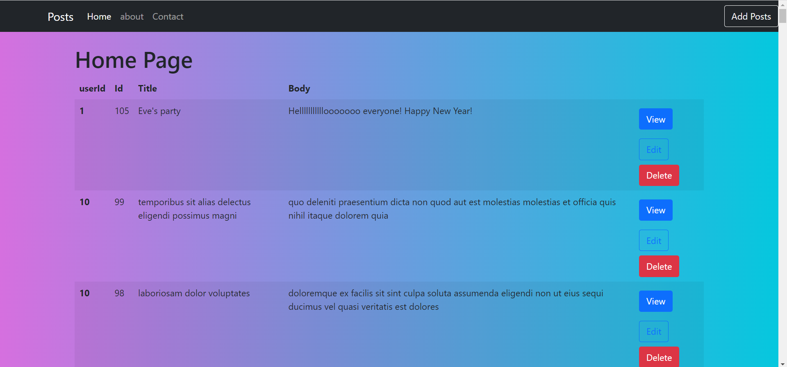
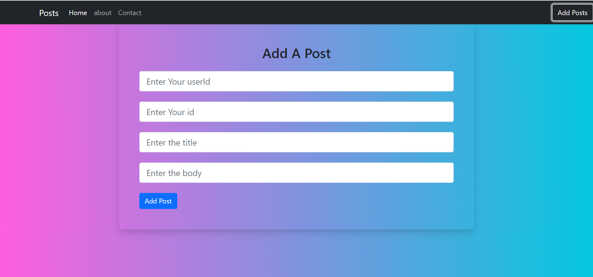
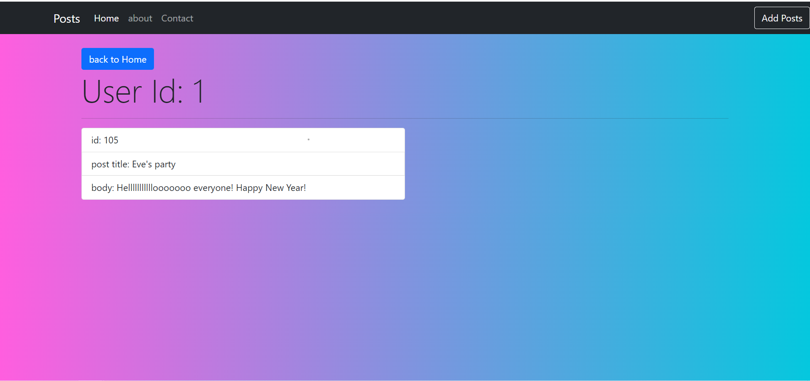
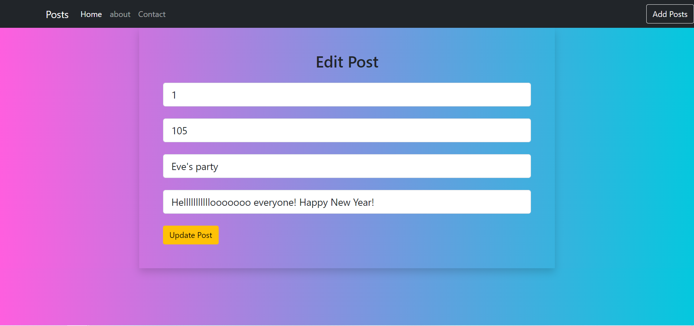
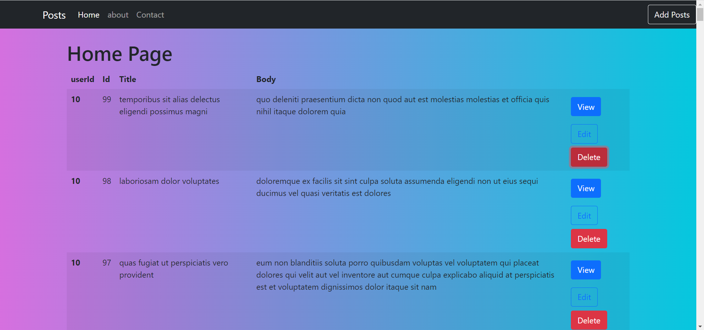

### Homepage

### Add post

### View Post

### Edit Post

### Delete Post

First of all, clone the project to your system and run the below commands

### `npm install`

To install all the dependencies

### `npm run start:dev`
It will run the app

